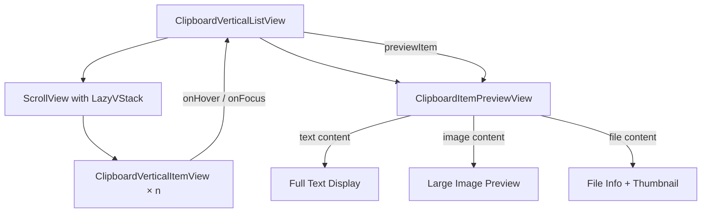

# Vertical List Preview Feature Implementation Plan

## Feature Summary

When a user hovers over or focuses (via arrow keys) an item in the vertical list layout (`.vertical` or `.compact`), the panel will expand to show a side preview area displaying:

- **For text items**: Full text content in a larger, readable format with syntax highlighting if applicable
- **For image items**: The actual image preview at larger size
- **For file items**: File thumbnail or icon with file details

## Current Architecture Analysis

### Key Files Involved

| File                              | Role                                                         |
| --------------------------------- | ------------------------------------------------------------ |
| `ClipboardVerticalListView.swift` | Main vertical list container - handles scroll, focus, layout |
| `ClipboardVerticalItemView.swift` | Individual item row - shows truncated preview                |
| `ClipboardMainView.swift`         | Root view - manages layout switching and ViewModel           |
| `ClipboardViewModel.swift`        | Business logic - selection state, content access             |

### Current Layout Structure (Vertical Mode)

```
ClipboardVerticalListView
└── ScrollView (.vertical)
    └── LazyVStack
        └── ForEach(items) → ClipboardVerticalItemView (×n)
```

### Current Item Layout (ClipboardVerticalItemView)

```
HStack
├── AppIconView (left)
├── VStack (center) - content preview, truncated
│   ├── Text/Image/FileIcon (lineLimit: 1-2)
│   └── ...
└── VStack (right) - timestamp
```

## Proposed Architecture

### Layout Structure Change

```
ClipboardVerticalListView
├── HStack (when preview active)
│   ├── ScrollView + LazyVStack (list) - reduced width
│   └── ClipboardItemPreviewView (preview panel)
└── ScrollView + LazyVStack (when preview hidden) - full width
```

### New State Variables Needed

In `ClipboardVerticalListView`:

- `previewItem: ClipboardItem?` - Currently previewed item (hover/focus)
- `isPreviewActive: Bool` - Whether preview panel is visible

### Component: ClipboardItemPreviewView

New view component (`ClipboardItemPreviewView.swift`) that shows:

- **Text content**: Full text with scrollable area, larger font, proper formatting
- **Image content**: Large image preview with checkerboard background for transparency
- **File content**: Large thumbnail with file info
- **Link content**: URL with title if available
- **Color content**: Color swatch with hex value

## Implementation Steps

### Step 1: Create ClipboardItemPreviewView

Create new file: `clipaste/Views/ClipboardItemPreviewView.swift`

```swift
struct ClipboardItemPreviewView: View {
    let item: ClipboardItem
    @ObservedObject var viewModel: ClipboardViewModel

    // Layout constants
    private let previewWidth: CGFloat = 320
    private let padding: CGFloat = 16

    var body: some View {
        VStack(alignment: .leading, spacing: 12) {
            // Header with item type and timestamp
            headerView

            // Content based on type
            contentView
        }
        .frame(width: previewWidth)
        .background(Color(nsColor: .windowBackgroundColor))
        .clipShape(RoundedRectangle(cornerRadius: 12))
        .shadow(color: Color.black.opacity(0.1), radius: 8, y: 4)
    }

    // ... implementation details for each content type
}
```

### Step 2: Modify ClipboardVerticalListView

**File**: `clipaste/Views/ClipboardVerticalListView.swift`

Changes:

1. Add state: `@State private var previewItem: ClipboardItem?`
2. Add state: `@State private var isPreviewExpanded = false`
3. Modify body to conditionally show preview panel
4. Pass hover/focus changes to preview state

### Step 3: Communicate Preview State to Items

**File**: `clipaste/Views/ClipboardVerticalItemView.swift`

Changes:

1. Accept new binding or callback for preview state
2. When item is hovered/focused, trigger preview in parent
3. Maintain existing hover visual effects

### Step 4: Handle Keyboard Navigation

**File**: `clipaste/ViewModels/ClipboardViewModel+Keyboard.swift`

Changes:

- When arrow key navigation occurs, update the preview item
- Preview should update as selection changes

### Step 5: Animation Refinements

Add smooth animations for:

- Preview panel slide-in/slide-out
- List width transition when preview activates
- Content fade in preview panel

## Preview Panel Content Types

### Text Content Display

```
VStack(alignment: .leading)
├── ScrollView (vertical)
│   └── Text(fullText)
│       .font(.system(size: 14))
│       .lineSpacing(4)
└── metadata (char count, etc.)
```

### Image Content Display

```
ZStack
├── CheckerboardBackground() (for transparency)
└── ClipboardThumbnailView(maxPixelSize: 600)
    .aspectRatio(contentMode: .fit)
```

### File Content Display

```
VStack
├── Large thumbnail (maxPixelSize: 400)
└── File path and metadata
```

## Mermaid Diagram: Component Interaction



## Edge Cases to Handle

1. **No item selected/hovered**: Preview panel hidden, list full width
2. **Rapid hover switching**: Debounce preview updates (100ms)
3. **Panel window resizing**: Preview width adapts, min width enforced
4. **Compact mode**: Smaller preview width (240px vs 320px)
5. **Image loading**: Show placeholder while high-res loads
6. **Very long text**: ScrollView within preview
7. **Very large images**: Fit within preview with aspect ratio

## Testing Considerations

1. Hover over text item → Preview shows full text
2. Hover over image item → Preview shows large image
3. Arrow key down/up → Preview updates with selection
4. Mouse leaves all items → Preview hides
5. Switch from horizontal to vertical → Feature works
6. Compact mode vs normal vertical mode

## Files to Modify/Create

| File                                                    | Action                                       |
| ------------------------------------------------------- | -------------------------------------------- |
| `clipaste/Views/ClipboardItemPreviewView.swift`         | **CREATE**                                   |
| `clipaste/Views/ClipboardVerticalListView.swift`        | **MODIFY**                                   |
| `clipaste/Views/ClipboardVerticalItemView.swift`        | **MODIFY**                                   |
| `clipaste/ViewModels/ClipboardViewModel+Keyboard.swift` | **MODIFY** (optional - may not need changes) |

## Success Criteria

1. ✅ Hovering over an item shows preview panel on the right
2. ✅ Using arrow keys to focus an item shows preview
3. ✅ Text content displays in full, readable format
4. ✅ Image content displays large preview
5. ✅ Animation is smooth (spring animation ~0.3s)
6. ✅ Preview hides when no item is hovered/focused
7. ✅ Works in both `.vertical` and `.compact` layouts
8. ✅ Does NOT affect horizontal layout
